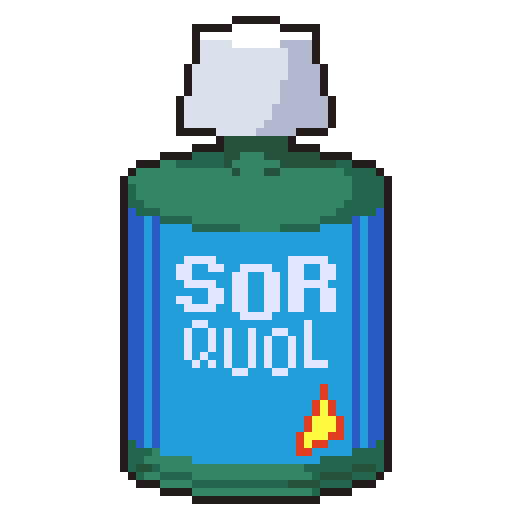

<h1 align="center">
SORQUOL
<em>
  

The mod that your fingers CRAVE!
</em>
</h1>
 

*Have you ever suffered from...*
- *Keyboardical frustrations?*
- *Mouseular strain of the fingers?*
- *Gout?*
- *Feeling like you just can't squeeze that chunk out?*

||Sorquol can help!  Hi, I'm DR* Trustworthy Francis Fella, MD**, and I'm here to teach you about the benefits of Sorquol! You can call me Trusty. And you can trust me. *Trust me!*
|:---|:---|

<h2> 
But what is Sorquol, Trusty?
</h2>

||Sorquol is a mod for Streets of Rogue designed to add ease-of-use features to all of the game's custom content editors.   That's where the name comes from: *Streets of Rogue QUality Of Life*! Wow, this is pretty educational, isn't it?
|:---|:---|

*Sorquol's effects include:*

- *The comforting warmth of Hotkeys...*
  - *for your [Chunk Editor!](Sorquol/Documentation/Hotkeys_Chunk.md)*
  - *for your [Level Editor!](Sorquol/Documentation/Hotkeys_Level.md)*
<!---  
  - *for your [Campaign Editor!](Sorquol/Documentation/Hotkeys_Campaign.md)*
  - *for your [Character Editor!](Sorquol/Documentation/Hotkeys_Character.md)*
  - *for your [Chunk Pack Editor!](Sorquol/Documentation/Hotkeys_ChunkPack.md)* 
--->
- *[Very possibly not Liver Toxicity!](https://www.mayoclinic.org/diseases-conditions/toxic-hepatitis/symptoms-causes/syc-20352202)*
- *Possibly even more fabulous features, [possibly](Sorquol/Documentation/PlannedFeatures.md)!*

<h2> 
I'm ready! How do I drink Sorquol?
</h2>

||We call it "Installation," and it's as easy as A to Z! Wait...
|:---|:---|

*To install, follow [this](https://steamcommunity.com/sharedfiles/filedetails/?id=2271959380) handy-dandy guide!*

<h2> 
How does Sorquol work, Doctor?
</h2>

||It's none of your fuckin' business how it works! And please, never ever call me "Doctor." I'm not exactly *not* a doctor, but there may be a federal injunction against explicitly saying I am. Damn regulatory red tape!
|:---|:---|

<h2> 
Who brought us the wonderful bounty of Sorquol?
</h2>

||I don't know. Can I go now?
|:---|:---|

- **Myself:** Most code, some images, documentation
- **DapperGentleman#5990:** Sprite art, glorious sprite art
- **Abbysssal#2020 & BlazingTwist#4559:** *Lots* of code help, and sometimes the code itself
- **SOR Discord Community:** Ideas, feedback, and amazing custom content

------

\* Director of Retail (Sales)

** Marketing Director

